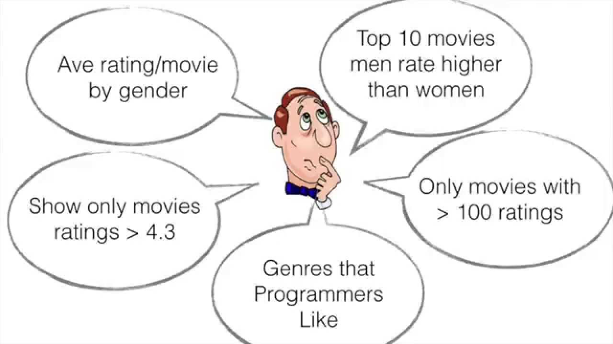

# Singular Value Decomposition with Numpy and SciPy

## Introduction

In this lab, we will build a basic version of low-rank matrix factorization engine for recommending movies in using Numpy and SciPy. The purpose of this lesson to help develop a sound understanding of how this process works in detail, before we implement it in PySpark. We will use a small movie recommendation dataset suitable for such experiments. The system should make not highly accurate, yet meaningful recommendations. 

## Objectives
- Build a basic recommendation system using MovieLense 1 million movies dataset
- Use Scipy and Numpy to build a recommendation system using matrix factorization. 


## Dataset
For this lab, we will use  a dataset of 1 million movie ratings  available from the [MovieLens](http://grouplens.org/datasets/movielens/) project collected by GroupLens Research at the University of Minnesota. The website offers many versions and subsets of the complete MovieLens dataset. We have downloaded the 1 million movies subset for you and you can find it under the folder `ml-1m`. [Visit this link](http://files.grouplens.org/datasets/movielens/ml-latest-README.html) and also the MovieLens site above to get an understanding of format for included files before moving on:

- ratings.dat
- users.dat
- movies.dat

Let's first read our dataset into pandas dataframe before moving on. 

Our datasets are `.dat` format with features split using the delimiter `'::'`. Perform following tasks:

- Read the files `ratings.dat`, `movies.dat` and `users.dat` using python's `open()`. Use `encoding='latin-1'` for these files
- Split above files on delimiter '::' and create arrays for users , movies and ratings

- Create ratings and movies dataframes from arrays above with columns:
    - `ratings = ['UID', 'MID', 'Rating', 'Time']`
    - `movies = ['MID', 'Title', 'Genre']`
- View the contents of `movies` and `ratings` datasets

*Note: Make sure to change the appropriate datatypes to int (numeric) in these datasets.*


```python

# Code here

```


```python
# Uncomment Below

# print(movies.head())
# print()
# print(ratings.head())
```

       MID                               Title                         Genre
    0    1                    Toy Story (1995)   Animation|Children's|Comedy
    1    2                      Jumanji (1995)  Adventure|Children's|Fantasy
    2    3             Grumpier Old Men (1995)                Comedy|Romance
    3    4            Waiting to Exhale (1995)                  Comedy|Drama
    4    5  Father of the Bride Part II (1995)                        Comedy
    
       UID   MID  Rating       Time
    0    1  1193       5  978300760
    1    1   661       3  978302109
    2    1   914       3  978301968
    3    1  3408       4  978300275
    4    1  2355       5  978824291


## Creating the Utility Matrix 

Matrix factorization, as we saw in the previous lesson, uses a "Utility Matrix" of users x movies. The intersection points between users and movies indicate the ratings users have given to movies. We saw how this is mostly sparse matrix. Here is a quick refresher below:


Next, our job is to create such a matrix from the ratings table above in order to proceed forward with SVD. 

- Create a utility matrix `A` to contain one row per user and one column per movie. Pivot `ratings` dataframe to achieve this. 


```python
# Create a utility matrix A by pivoting ratings.df

# Code here
```


<div>
<style scoped>
    .dataframe tbody tr th:only-of-type {
        vertical-align: middle;
    }

    .dataframe tbody tr th {
        vertical-align: top;
    }

    .dataframe thead th {
        text-align: right;
    }
</style>
<table border="1" class="dataframe">
  <thead>
    <tr style="text-align: right;">
      <th>MID</th>
      <th>1</th>
      <th>2</th>
      <th>3</th>
      <th>4</th>
      <th>5</th>
      <th>6</th>
      <th>7</th>
      <th>8</th>
      <th>9</th>
      <th>10</th>
      <th>...</th>
      <th>3943</th>
      <th>3944</th>
      <th>3945</th>
      <th>3946</th>
      <th>3947</th>
      <th>3948</th>
      <th>3949</th>
      <th>3950</th>
      <th>3951</th>
      <th>3952</th>
    </tr>
    <tr>
      <th>UID</th>
      <th></th>
      <th></th>
      <th></th>
      <th></th>
      <th></th>
      <th></th>
      <th></th>
      <th></th>
      <th></th>
      <th></th>
      <th></th>
      <th></th>
      <th></th>
      <th></th>
      <th></th>
      <th></th>
      <th></th>
      <th></th>
      <th></th>
      <th></th>
      <th></th>
    </tr>
  </thead>
  <tbody>
    <tr>
      <th>1</th>
      <td>5.0</td>
      <td>0.0</td>
      <td>0.0</td>
      <td>0.0</td>
      <td>0.0</td>
      <td>0.0</td>
      <td>0.0</td>
      <td>0.0</td>
      <td>0.0</td>
      <td>0.0</td>
      <td>...</td>
      <td>0.0</td>
      <td>0.0</td>
      <td>0.0</td>
      <td>0.0</td>
      <td>0.0</td>
      <td>0.0</td>
      <td>0.0</td>
      <td>0.0</td>
      <td>0.0</td>
      <td>0.0</td>
    </tr>
    <tr>
      <th>2</th>
      <td>0.0</td>
      <td>0.0</td>
      <td>0.0</td>
      <td>0.0</td>
      <td>0.0</td>
      <td>0.0</td>
      <td>0.0</td>
      <td>0.0</td>
      <td>0.0</td>
      <td>0.0</td>
      <td>...</td>
      <td>0.0</td>
      <td>0.0</td>
      <td>0.0</td>
      <td>0.0</td>
      <td>0.0</td>
      <td>0.0</td>
      <td>0.0</td>
      <td>0.0</td>
      <td>0.0</td>
      <td>0.0</td>
    </tr>
    <tr>
      <th>3</th>
      <td>0.0</td>
      <td>0.0</td>
      <td>0.0</td>
      <td>0.0</td>
      <td>0.0</td>
      <td>0.0</td>
      <td>0.0</td>
      <td>0.0</td>
      <td>0.0</td>
      <td>0.0</td>
      <td>...</td>
      <td>0.0</td>
      <td>0.0</td>
      <td>0.0</td>
      <td>0.0</td>
      <td>0.0</td>
      <td>0.0</td>
      <td>0.0</td>
      <td>0.0</td>
      <td>0.0</td>
      <td>0.0</td>
    </tr>
    <tr>
      <th>4</th>
      <td>0.0</td>
      <td>0.0</td>
      <td>0.0</td>
      <td>0.0</td>
      <td>0.0</td>
      <td>0.0</td>
      <td>0.0</td>
      <td>0.0</td>
      <td>0.0</td>
      <td>0.0</td>
      <td>...</td>
      <td>0.0</td>
      <td>0.0</td>
      <td>0.0</td>
      <td>0.0</td>
      <td>0.0</td>
      <td>0.0</td>
      <td>0.0</td>
      <td>0.0</td>
      <td>0.0</td>
      <td>0.0</td>
    </tr>
    <tr>
      <th>5</th>
      <td>0.0</td>
      <td>0.0</td>
      <td>0.0</td>
      <td>0.0</td>
      <td>0.0</td>
      <td>2.0</td>
      <td>0.0</td>
      <td>0.0</td>
      <td>0.0</td>
      <td>0.0</td>
      <td>...</td>
      <td>0.0</td>
      <td>0.0</td>
      <td>0.0</td>
      <td>0.0</td>
      <td>0.0</td>
      <td>0.0</td>
      <td>0.0</td>
      <td>0.0</td>
      <td>0.0</td>
      <td>0.0</td>
    </tr>
  </tbody>
</table>
<p>5 rows × 3706 columns</p>
</div>


Finally, let's perform mean normalization on our utility matrix, and save it as a numpy array for decomposition tasks.


```python
# Mean normalize dataframe A to numpy array A_norm


# Code here 


```


    array([[ 4.94009714, -0.05990286, -0.05990286, ..., -0.05990286,
            -0.05990286, -0.05990286],
           [-0.12924987, -0.12924987, -0.12924987, ..., -0.12924987,
            -0.12924987, -0.12924987],
           [-0.05369671, -0.05369671, -0.05369671, ..., -0.05369671,
            -0.05369671, -0.05369671],
           ...,
           [ 3.85429034, -0.14570966, -0.14570966, ..., -0.14570966,
            -0.14570966, -0.14570966],
           [ 4.89314625, -0.10685375, -0.10685375, ..., -0.10685375,
            -0.10685375, -0.10685375],
           [ 4.55477604,  4.55477604, -0.44522396, ..., -0.44522396,
            -0.44522396, -0.44522396]])


## Matrix Factorization with SVD

SVD can help us decomposes the matrix $A$ into the best lower rank approximation of the original matrix $A$. Mathematically, it decomposes $A$ into a two unitary matrices and a diagonal matrix:

$$\begin{equation}
A = U\Sigma V^{T}
\end{equation}$$

A above is users' ratings matrix (utility), $U$ is the user "features" matrix, $\Sigma$ is the diagonal matrix of singular values (essentially weights), and $V^{T}$ is the movie "features" matrix. $U$ and $V^{T}$ are orthogonal, and represent different things. $U$ represents how much users "like" each feature and $V^{T}$ represents how relevant each feature is to each movie.

To get the lower rank approximation, we take these matrices and keep only the top $k$ features, which we think of as the underlying tastes and preferences vectors.

Perform following tasks:
- Import `svds` from Scipy
- decompose A_norm using 50 factors i.e. pass `k=50` argument to `svds()`


```python

# Code here 

```

### Creating diagonal matrix for sigma factors

The sigma above is returned as a 1 dimensional array of latent factor values. As we need to perform matrix multiplication in our next part, lets convert it to a diagonal matrix using `np.diag()`. [Here is an explanation for this](https://math.stackexchange.com/questions/1731183/convert-vector-into-diagonal-matrix)

- Convert sigma factors into a diagonal matrix with `np.diag()`
- Check and confirm the shape of `sigma` befora and after conversion 


```python

# Code here


```

    [ 147.18581225  147.62154312  148.58855276  150.03171353  151.79983807
      153.96248652  154.29956787  154.54519202  156.1600638   157.59909505
      158.55444246  159.49830789  161.17474208  161.91263179  164.2500819
      166.36342107  166.65755956  167.57534795  169.76284423  171.74044056
      176.69147709  179.09436104  181.81118789  184.17680849  186.29341046
      192.15335604  192.56979125  199.83346621  201.19198515  209.67692339
      212.55518526  215.46630906  221.6502159   231.38108343  239.08619469
      244.8772772   252.13622776  256.26466285  275.38648118  287.89180228
      315.0835415   335.08085421  345.17197178  362.26793969  415.93557804
      434.97695433  497.2191638   574.46932602  670.41536276 1544.10679346] (50,)


    (array([[ 147.18581225,    0.        ,    0.        , ...,    0.        ,
                0.        ,    0.        ],
            [   0.        ,  147.62154312,    0.        , ...,    0.        ,
                0.        ,    0.        ],
            [   0.        ,    0.        ,  148.58855276, ...,    0.        ,
                0.        ,    0.        ],
            ...,
            [   0.        ,    0.        ,    0.        , ...,  574.46932602,
                0.        ,    0.        ],
            [   0.        ,    0.        ,    0.        , ...,    0.        ,
              670.41536276,    0.        ],
            [   0.        ,    0.        ,    0.        , ...,    0.        ,
                0.        , 1544.10679346]]), (50, 50))


Excellent, We changed sigma from a vector of size fifty to a 2D diagonal matrix of size 50x50. We can now move on to making predictions from our decomposed matrices. 

## Making Predictions from the Decomposed Matrices

Now we have everything required to make movie ratings predictions for every user. We will do it all at once by following the math and matrix multiply $U$, $\Sigma$, and $V^{T}$ back to get the rank $k=50$ __approximation of $A$__. Perform following tasks to achieve this

* Use `np.dot()` to multiply $U,\Sigma, V$
* add the user ratings means back to get the actual __star__ ratings prediction.


```python

# Code here 


```

#### For a practical system, the value of `k` above would be identified through creating test and training datasets and selecting optimal value of this parameter. We will leave this bit for our detailed experiment in the next lab. 

Here, we'll see how to make recommendations based on `predictions` array created above.


### Making Recommendations 

With the predictions matrix for every user, we can build a function to recommend movies for any user. We need to return the movies with the highest predicted rating that the specified user hasn't already rated. We will also merge in the user information to get a more complete picture of the recommendations. We will also return the list of movies the user has already rated, for the sake of comparison.
- Create a Dataframe from predictions and view contents
- Use column names of `A` as the new names for this dataframe


```python

# Code here 

```


<div>
<style scoped>
    .dataframe tbody tr th:only-of-type {
        vertical-align: middle;
    }

    .dataframe tbody tr th {
        vertical-align: top;
    }

    .dataframe thead th {
        text-align: right;
    }
</style>
<table border="1" class="dataframe">
  <thead>
    <tr style="text-align: right;">
      <th>MID</th>
      <th>1</th>
      <th>2</th>
      <th>3</th>
      <th>4</th>
      <th>5</th>
      <th>6</th>
      <th>7</th>
      <th>8</th>
      <th>9</th>
      <th>10</th>
      <th>...</th>
      <th>3943</th>
      <th>3944</th>
      <th>3945</th>
      <th>3946</th>
      <th>3947</th>
      <th>3948</th>
      <th>3949</th>
      <th>3950</th>
      <th>3951</th>
      <th>3952</th>
    </tr>
  </thead>
  <tbody>
    <tr>
      <th>0</th>
      <td>4.288861</td>
      <td>0.143055</td>
      <td>-0.195080</td>
      <td>-0.018843</td>
      <td>0.012232</td>
      <td>-0.176604</td>
      <td>-0.074120</td>
      <td>0.141358</td>
      <td>-0.059553</td>
      <td>-0.195950</td>
      <td>...</td>
      <td>0.027807</td>
      <td>0.001640</td>
      <td>0.026395</td>
      <td>-0.022024</td>
      <td>-0.085415</td>
      <td>0.403529</td>
      <td>0.105579</td>
      <td>0.031912</td>
      <td>0.050450</td>
      <td>0.088910</td>
    </tr>
    <tr>
      <th>1</th>
      <td>0.744716</td>
      <td>0.169659</td>
      <td>0.335418</td>
      <td>0.000758</td>
      <td>0.022475</td>
      <td>1.353050</td>
      <td>0.051426</td>
      <td>0.071258</td>
      <td>0.161601</td>
      <td>1.567246</td>
      <td>...</td>
      <td>-0.056502</td>
      <td>-0.013733</td>
      <td>-0.010580</td>
      <td>0.062576</td>
      <td>-0.016248</td>
      <td>0.155790</td>
      <td>-0.418737</td>
      <td>-0.101102</td>
      <td>-0.054098</td>
      <td>-0.140188</td>
    </tr>
    <tr>
      <th>2</th>
      <td>1.818824</td>
      <td>0.456136</td>
      <td>0.090978</td>
      <td>-0.043037</td>
      <td>-0.025694</td>
      <td>-0.158617</td>
      <td>-0.131778</td>
      <td>0.098977</td>
      <td>0.030551</td>
      <td>0.735470</td>
      <td>...</td>
      <td>0.040481</td>
      <td>-0.005301</td>
      <td>0.012832</td>
      <td>0.029349</td>
      <td>0.020866</td>
      <td>0.121532</td>
      <td>0.076205</td>
      <td>0.012345</td>
      <td>0.015148</td>
      <td>-0.109956</td>
    </tr>
    <tr>
      <th>3</th>
      <td>0.408057</td>
      <td>-0.072960</td>
      <td>0.039642</td>
      <td>0.089363</td>
      <td>0.041950</td>
      <td>0.237753</td>
      <td>-0.049426</td>
      <td>0.009467</td>
      <td>0.045469</td>
      <td>-0.111370</td>
      <td>...</td>
      <td>0.008571</td>
      <td>-0.005425</td>
      <td>-0.008500</td>
      <td>-0.003417</td>
      <td>-0.083982</td>
      <td>0.094512</td>
      <td>0.057557</td>
      <td>-0.026050</td>
      <td>0.014841</td>
      <td>-0.034224</td>
    </tr>
    <tr>
      <th>4</th>
      <td>1.574272</td>
      <td>0.021239</td>
      <td>-0.051300</td>
      <td>0.246884</td>
      <td>-0.032406</td>
      <td>1.552281</td>
      <td>-0.199630</td>
      <td>-0.014920</td>
      <td>-0.060498</td>
      <td>0.450512</td>
      <td>...</td>
      <td>0.110151</td>
      <td>0.046010</td>
      <td>0.006934</td>
      <td>-0.015940</td>
      <td>-0.050080</td>
      <td>-0.052539</td>
      <td>0.507189</td>
      <td>0.033830</td>
      <td>0.125706</td>
      <td>0.199244</td>
    </tr>
  </tbody>
</table>
<p>5 rows × 3706 columns</p>
</div>


Now we have a predictions dataframe composed from a reduced factors. We can now can predicted recommendations for every user. We will create a new function `recommender()` as shown below: 

- `recommender()`
    - Inputs: predictions dataframe , chosen UserID, movies dataframe, original ratings df, num_recommendations
    - Outputs: Movies already rated by user, predicted ratings for remaining movies for user

- Get and set of predictions for selected user and sort in descending order
- Get the movies already rated by user and sort them in descending order by rating
- Create a set of recommendations for all movies, not yet rated by the user


```python
# Recommending top movies not yet rated by user
def recommender(predictions_df, UID, movies_df, original_ratings_df, num_recommendations=5):
    
    # Get and sort the user's predictions
    user_row = None # UID starts at 1, not 0
    sorted_predictions = None
    
    # Get the original user data and merge in the movie information 
    user_data = None 
    user_full = None

    
    # Recommend the highest predicted rating movies that the user hasn't seen yet.
    recommendations = None
                    
    # Print user information
    
    
    pass #return user_full, recommendations
```

Using above function, we can now get a set of recommendations for any user. 


```python
# Get a list of already reated and recommended movies for a selected user
# Uncomment to run below


#rated, recommended = recommender(predictions_df, 100, movies, ratings, 10)
```

    User 100 has already rated 76 movies.
    Recommending highest 10 predicted ratings movies not already rated.


```python
# Uncomment to run 

# rated.head(10)
```


<div>
<style scoped>
    .dataframe tbody tr th:only-of-type {
        vertical-align: middle;
    }

    .dataframe tbody tr th {
        vertical-align: top;
    }

    .dataframe thead th {
        text-align: right;
    }
</style>
<table border="1" class="dataframe">
  <thead>
    <tr style="text-align: right;">
      <th></th>
      <th>UID</th>
      <th>MID</th>
      <th>Rating</th>
      <th>Time</th>
      <th>Title</th>
      <th>Genre</th>
    </tr>
  </thead>
  <tbody>
    <tr>
      <th>1</th>
      <td>100</td>
      <td>800</td>
      <td>5</td>
      <td>977593915</td>
      <td>Lone Star (1996)</td>
      <td>Drama|Mystery</td>
    </tr>
    <tr>
      <th>63</th>
      <td>100</td>
      <td>527</td>
      <td>5</td>
      <td>977594839</td>
      <td>Schindler's List (1993)</td>
      <td>Drama|War</td>
    </tr>
    <tr>
      <th>16</th>
      <td>100</td>
      <td>919</td>
      <td>5</td>
      <td>977594947</td>
      <td>Wizard of Oz, The (1939)</td>
      <td>Adventure|Children's|Drama|Musical</td>
    </tr>
    <tr>
      <th>17</th>
      <td>100</td>
      <td>924</td>
      <td>4</td>
      <td>977594873</td>
      <td>2001: A Space Odyssey (1968)</td>
      <td>Drama|Mystery|Sci-Fi|Thriller</td>
    </tr>
    <tr>
      <th>29</th>
      <td>100</td>
      <td>969</td>
      <td>4</td>
      <td>977594044</td>
      <td>African Queen, The (1951)</td>
      <td>Action|Adventure|Romance|War</td>
    </tr>
    <tr>
      <th>22</th>
      <td>100</td>
      <td>2406</td>
      <td>4</td>
      <td>977594142</td>
      <td>Romancing the Stone (1984)</td>
      <td>Action|Adventure|Comedy|Romance</td>
    </tr>
    <tr>
      <th>47</th>
      <td>100</td>
      <td>318</td>
      <td>4</td>
      <td>977594839</td>
      <td>Shawshank Redemption, The (1994)</td>
      <td>Drama</td>
    </tr>
    <tr>
      <th>20</th>
      <td>100</td>
      <td>858</td>
      <td>4</td>
      <td>977593950</td>
      <td>Godfather, The (1972)</td>
      <td>Action|Crime|Drama</td>
    </tr>
    <tr>
      <th>49</th>
      <td>100</td>
      <td>329</td>
      <td>4</td>
      <td>977594297</td>
      <td>Star Trek: Generations (1994)</td>
      <td>Action|Adventure|Sci-Fi</td>
    </tr>
    <tr>
      <th>50</th>
      <td>100</td>
      <td>260</td>
      <td>4</td>
      <td>977593595</td>
      <td>Star Wars: Episode IV - A New Hope (1977)</td>
      <td>Action|Adventure|Fantasy|Sci-Fi</td>
    </tr>
  </tbody>
</table>
</div>


```python
# Uncomment to run

# print ("\nTop Ten recommendations for selected user" )
# recommended
```

    
    Top Ten recommendations for selected user


<div>
<style scoped>
    .dataframe tbody tr th:only-of-type {
        vertical-align: middle;
    }

    .dataframe tbody tr th {
        vertical-align: top;
    }

    .dataframe thead th {
        text-align: right;
    }
</style>
<table border="1" class="dataframe">
  <thead>
    <tr style="text-align: right;">
      <th></th>
      <th>MID</th>
      <th>Title</th>
      <th>Genre</th>
    </tr>
  </thead>
  <tbody>
    <tr>
      <th>1311</th>
      <td>1374</td>
      <td>Star Trek: The Wrath of Khan (1982)</td>
      <td>Action|Adventure|Sci-Fi</td>
    </tr>
    <tr>
      <th>1148</th>
      <td>1193</td>
      <td>One Flew Over the Cuckoo's Nest (1975)</td>
      <td>Drama</td>
    </tr>
    <tr>
      <th>1312</th>
      <td>1376</td>
      <td>Star Trek IV: The Voyage Home (1986)</td>
      <td>Action|Adventure|Sci-Fi</td>
    </tr>
    <tr>
      <th>285</th>
      <td>296</td>
      <td>Pulp Fiction (1994)</td>
      <td>Crime|Drama</td>
    </tr>
    <tr>
      <th>570</th>
      <td>590</td>
      <td>Dances with Wolves (1990)</td>
      <td>Adventure|Drama|Western</td>
    </tr>
    <tr>
      <th>1184</th>
      <td>1240</td>
      <td>Terminator, The (1984)</td>
      <td>Action|Sci-Fi|Thriller</td>
    </tr>
    <tr>
      <th>877</th>
      <td>912</td>
      <td>Casablanca (1942)</td>
      <td>Drama|Romance|War</td>
    </tr>
    <tr>
      <th>1161</th>
      <td>1214</td>
      <td>Alien (1979)</td>
      <td>Action|Horror|Sci-Fi|Thriller</td>
    </tr>
    <tr>
      <th>1524</th>
      <td>1617</td>
      <td>L.A. Confidential (1997)</td>
      <td>Crime|Film-Noir|Mystery|Thriller</td>
    </tr>
    <tr>
      <th>997</th>
      <td>1036</td>
      <td>Die Hard (1988)</td>
      <td>Action|Thriller</td>
    </tr>
  </tbody>
</table>
</div>


For above randomly selected user `100`, we can subjectively evaluate that the recommender is doing a decent job. The movies being recommended are quite similar in taste as movies already rated by user. Remember this system is built using only a small subset of the complete MovieLense database which carries potential for significant improvement in predictive performance.  

## Level Up - Optional 

- Run the experiment again using validation testing to identify the optimal value of rank `k`
- Create Test and Train datasets to predict and evaluate the ratings using a suitable method (e.g. RMSE)
- How much of an improvement do you see in recommendations as a result of validation ? 

- Ask other interesting questions


## Additional Resources
- https://towardsdatascience.com/how-to-build-a-simple-song-recommender-296fcbc8c85 - A similar system recommending songs to users

- http://surpriselib.com/ Surprise is a Python Scikit is a very popular module for building receommendation systems

## Summary

In this lab, we learned that we can make good recommendations with collaborative filtering methods using latent features from low-rank matrix factorization methods. This technique also scales significantly better to larger datasets. We will next work with a larger MovieLense dataset and using the mapreduce techniques seen in the previous section, we will use PySpark to implement a similar approach using an implementation of matrix factorization called Alternating Least Squares (ALS) method. 
